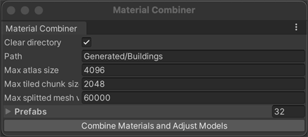

Combine Static Meshes and Atlas
===============================
An editor tool used to optimise meshes and materials for better draw call batching.

## Usage

Select Window -> Material Combiner, drag model prefabs into `Prefabs` field, configure combiner settings and start optimisation. This might take a few minutes.
